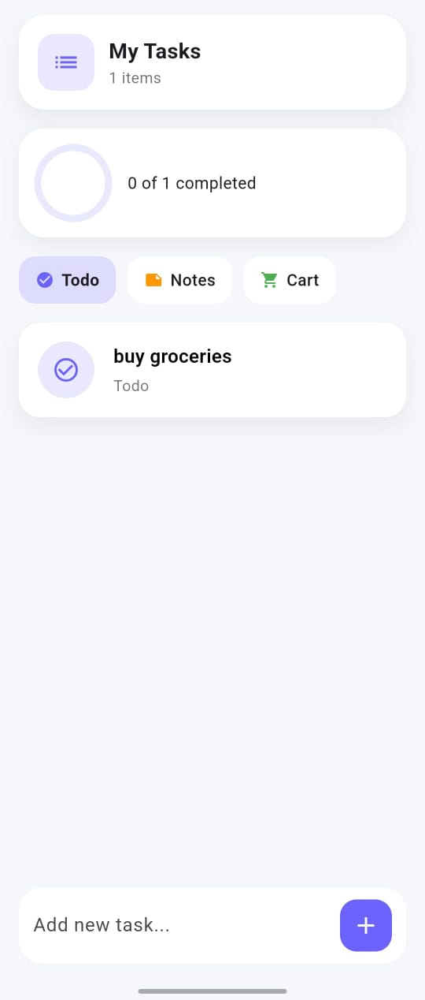
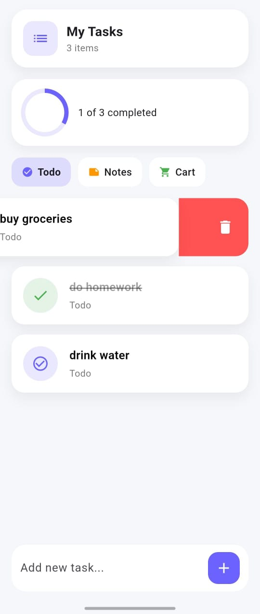
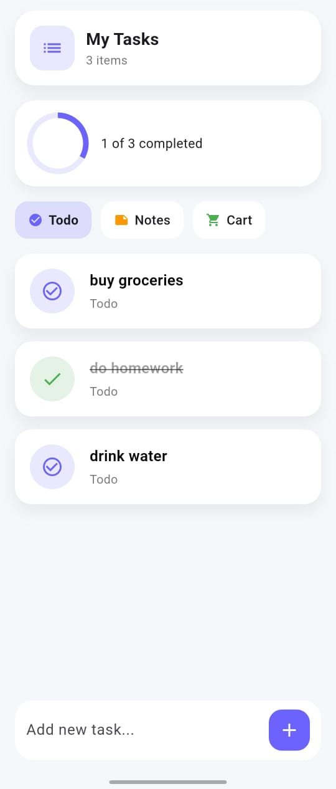
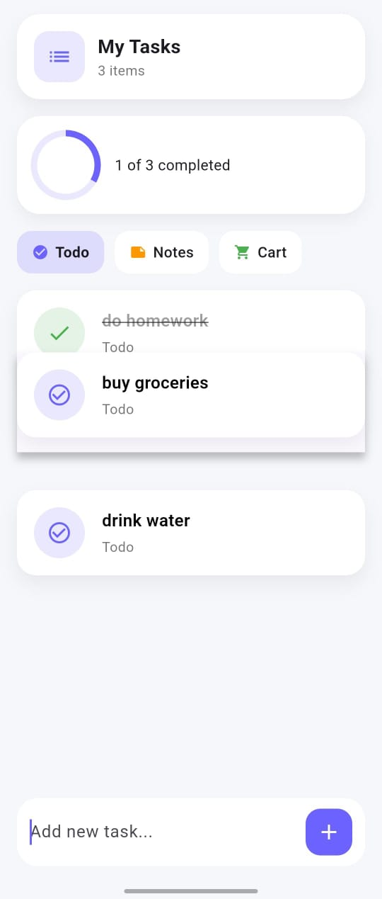

# Habit Tracker App

A clean and minimal habit tracker built using Flutter.

## Features
- Add, edit, delete tasks
- Category-based organization (Todo, Notes, Cart)
- Mark tasks as completed
- Progress tracking with circular indicator
- Local storage using SharedPreferences
- Smooth animations and modern UI

## 📸 Screenshots

  
  

  
  

  

## Tech Stack
- Flutter
- Dart

## Status
In progress 🚧
